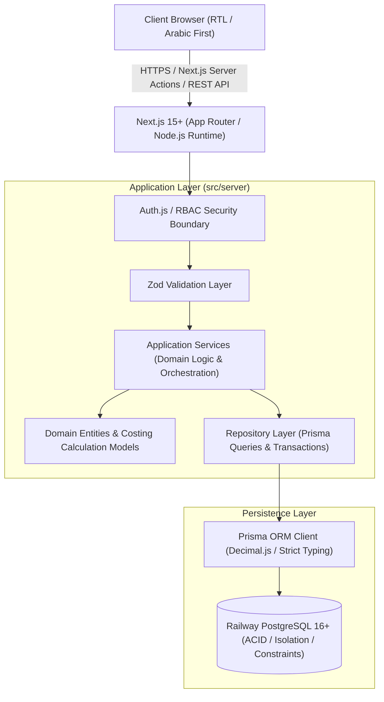

# Trading, Manufacturing & Inventory Management System
## System Architecture & Technical Specifications

---

## 1. Executive Summary & Vision

The system is a production-grade Enterprise Resource Planning (ERP) platform designed specifically for trading and outsourced manufacturing businesses. Unlike traditional accounting software or simple inventory trackers, this system unifies:
- **Purchasing & Inward Logistics**
- **Specific Batch / Lot Costing & Traceability**
- **Outsourced Manufacturing Operations & Cost Accumulation**
- **Multi-Output Joint Product Cost Allocation**
- **Multi-Batch Sales Allocation & Profitability Protection**
- **Transaction-Driven Accounting Ledgers (Supplier, Customer, Factory, Cash/Bank)**
- **Reversible Open Document Lifecycle Engine**
- **Role-Based Authorization & Comprehensive Audit Trail**

The primary deployment target is **GitHub** for version control, **Railway** for containerized application hosting, and **PostgreSQL on Railway** as the single source of truth.

---

## 2. Technology Stack Architecture



### 2.1 Core Technologies
- **Frontend Framework**: Next.js 15+ (App Router, Server Components & Client Components where interactivity is needed).
- **Language**: TypeScript 5+ in strict mode.
- **UI & Styling**: Tailwind CSS, shadcn/ui (accessible Radix UI primitives), Lucide React icons.
- **RTL & Localization**: Arabic-first UI with native RTL layout (`dir="rtl"`), Cairo / IBM Plex Sans Arabic typography, English-ready translation architecture.
- **Backend Runtime**: Next.js Node.js server runtime utilizing Server Actions for internal mutations and Route Handlers for external APIs and `/health`.
- **Database & Persistence**: PostgreSQL 16+ on Railway.
- **ORM**: Prisma ORM 6+ with automated migrations, connection pooling, and `Decimal(18, 4)` data types for financial and quantity precision.
- **Security & Auth**: Auth.js / NextAuth v5 with bcryptjs password hashing and server-side RBAC middleware.
- **Data Tables & Forms**: TanStack Table v8 for server-side pagination, search, and filtering; React Hook Form + Zod for robust client and server validation.
- **Testing**: Vitest for unit & integration tests, Playwright for E2E workflows.

---

## 3. High-Level Layered Architecture

To prevent architectural degradation and maintain strict separation of concerns, the codebase follows a 5-tier layered design:

```
src/
├── app/                       # Presentation & Routing (Server Components, Route Handlers, Action Entrypoints)
├── components/                # Reusable UI Components (shadcn/ui, Data Tables, Form Controls, Modals)
├── features/                  # Feature Modules (Purchases, Manufacturing, Sales, Accounting, Inventory)
├── server/
│   ├── domain/                # Pure Business Rules, Cost Calculations, Allocation Formulas (No DB dependencies)
│   ├── services/              # Application Orchestration, Multi-Entity Atomic Transactions, Audit Events
│   ├── repositories/          # Prisma Data Access, Complex Queries, Locking Mechanisms
│   ├── validators/            # Zod Schemas for API payloads and form inputs
│   └── permissions/           # RBAC permission matrix and server-side authorization guards
└── lib/                       # Infrastructure Utilities (Prisma Client, Auth config, Currency/Date formatters)
```

### 3.1 Strict Layering Rules
1. **Never execute raw Prisma queries directly in UI Components or Server Actions**. All business operations must flow through the Service Layer.
2. **Every state-mutating operation involving multiple entities must be wrapped in a Prisma Transaction (`prisma.$transaction`)**.
3. **Domain calculations (e.g. batch cost allocation, gross profit, sales below cost validation) must reside in pure domain functions** to ensure 100% testability independent of database state.
4. **All monetary and quantity operations must use `Decimal` or equivalent fixed-point math**. Floating-point `Number` arithmetic is strictly forbidden for financial calculations.

---

## 4. Ledger & Accounting Architecture

The system explicitly rejects storing balances as independently incremented/decremented fields. Stored balance fields exist only as fast read caches/projections that are strictly derived from and reconcilable against the underlying **Partner Ledger Entries**.

### 4.1 Double-Entry Balance Mechanics
Every financial event produces corresponding debit and credit movements:

| Business Event | Customer Ledger | Supplier Ledger | Factory Ledger | Cash / Bank Ledger |
|---|---|---|---|---|
| **Purchase Confirmed** | - | **Credit** (We owe supplier) | - | - |
| **Supplier Payment** | - | **Debit** (Reduces payable) | - | **Credit** (Cash outflow) |
| **Factory Charge (Service Fee)** | - | - | **Credit** (We owe factory) | - |
| **Factory Payment** | - | - | **Debit** (Reduces factory debt) | **Credit** (Cash outflow) |
| **Operational Expense (Direct)** | - | - | - | **Credit** (Cash outflow) |
| **Credit Sale Finalized** | **Debit** (Customer owes us) | - | - | - |
| **Customer Payment Received**| **Credit** (Reduces debt) | - | - | **Debit** (Cash inflow) |

### 4.2 Unified Partner Domain Model
To prevent entity duplication when a business partner acts in multiple roles (e.g. a Factory that also supplies raw materials or purchases scrap goods), the system models a unified `BusinessPartner` with role flags:
- `isSupplier: boolean`
- `isCustomer: boolean`
- `isFactory: boolean`

Ledger entries are recorded against `partnerId` with an explicit `referenceType` (`PURCHASE_INVOICE`, `SALES_INVOICE`, `MANUFACTURING_CHARGE`, `PAYMENT`, `RECEIPT`, `ADJUSTMENT`), allowing unified statements as well as role-filtered statements.

---

## 5. Inventory Transaction & Specific Batch Costing Architecture

### 5.1 The Specific Batch Costing Principle
- **No Average Costing**: Global average costing masks margin variations and prevents actual production cost analysis.
- **No Pure FIFO Assumption**: In physical manufacturing and trading, physical batches are pulled based on quality, batch code, or specific order assignment.
- **Specific Batch Identity**: Every inward movement generates an immutable `InventoryBatch` with:
  - `batchNumber`: Unique identifier (e.g., `BAT-2026-000001`).
  - `productId`: Foreign key to Product.
  - `warehouseId`: Foreign key to Warehouse.
  - `sourceType`: `PURCHASE`, `MANUFACTURING`, `OPENING_BALANCE`, `ADJUSTMENT`.
  - `initialQuantity`: Original received quantity.
  - `remainingQuantity`: Current available balance in that lot.
  - `unitCost`: Exact unit acquisition or production cost (`NUMERIC(18, 4)`).
  - `totalCost`: Initial lot valuation.

### 5.2 Multi-Batch Sales Allocation
A single line item in a sales invoice for 100 units can allocate stock across multiple batches:
```
Sales Invoice Line: Product A (100 units)
├── Allocation 1: Batch #BAT-001 -> 60 units @ 80.00 EGP = 4,800.00 EGP
└── Allocation 2: Batch #BAT-002 -> 40 units @ 95.00 EGP = 3,800.00 EGP
-------------------------------------------------------------------------
Total Cost of Sale Line: 8,600.00 EGP (Unit Cost: 86.00 EGP)
Selling Price: 120.00 EGP * 100 = 12,000.00 EGP
Gross Profit: 12,000.00 - 8,600.00 = 3,400.00 EGP
```

### 5.3 Inventory Transaction Ledger
Every physical stock delta is permanently logged in `InventoryTransaction`:
- `PURCHASE_RECEIPT` (+)
- `SALE` (-)
- `SALE_RETURN` (+)
- `MANUFACTURING_CONSUMPTION` (-)
- `MANUFACTURING_OUTPUT` (+)
- `TRANSFER_IN` (+) / `TRANSFER_OUT` (-)
- `ADJUSTMENT_IN` (+) / `ADJUSTMENT_OUT` (-)

---

## 6. Manufacturing Engine & Cost Accumulation

```mermaid
flowchart TD
    subgraph Inputs ["Manufacturing Inputs (Consumed Batches)"]
        RM1["Raw Material A (Batch 101)"] -->|Cost: 10,000 EGP| MO["Manufacturing Order"]
        RM2["Raw Material B (Batch 102)"] -->|Cost: 5,000 EGP| MO
        SF1["Semi-Finished C (Batch 201)"] -->|Cost: 3,000 EGP| MO
    end

    subgraph Additions ["Expenses & Charges"]
        EXP["Operational Expenses (Transport, Packaging)"] -->|Cost: 2,000 EGP| MO
        FC["Factory Payable Charge (Service Fee)"] -->|Cost: 10,000 EGP| MO
    end

    MO -->|Total Accumulated Cost: 30,000 EGP| Allocation{"Cost Allocation Engine"}

    subgraph Outputs ["Manufactured Output Products"]
        Allocation -->|60% (18,000 EGP) / 500 units| P1["Product 1: Unit Cost = 36.00 EGP"]
        Allocation -->|30% (9,000 EGP) / 300 units| P2["Product 2: Unit Cost = 30.00 EGP"]
        Allocation -->|10% (3,000 EGP) / 100 units| P3["Product 3: Unit Cost = 30.00 EGP"]
    end
```

### 6.1 Multi-Output Cost Allocation Formulas
- **Manual Percentage Allocation**: User specifies percentage per output; system enforces `\sum \text{percentage} = 100.00\%`.
- **Unit Cost Derivation**:
  $$\text{Allocated Cost}_i = \text{Total Manufacturing Cost} \times \left(\frac{\text{Percentage}_i}{100}\right)$$
  $$\text{Unit Cost}_i = \frac{\text{Allocated Cost}_i}{\text{Output Quantity}_i}$$
- **Fractional Penny Balancing**: Any fractional rounding remainder across line allocations is attributed to the largest allocation line, guaranteeing zero discrepancy between total input cost and total output inventory capitalization.

---

## 7. Concurrency & Transactional Integrity

To prevent stock overselling under concurrent requests:
1. All inventory deductions execute within serializable or row-locked transactions (`SELECT ... FOR UPDATE` or atomic decrement with conditional guard):
   ```sql
   UPDATE "InventoryBatch"
   SET "remainingQuantity" = "remainingQuantity" - :requestedQty,
       "updatedAt" = NOW()
   WHERE "id" = :batchId AND "remainingQuantity" >= :requestedQty;
   ```
   If the update returns 0 affected rows, the transaction immediately rolls back and throws an `INSUFFICIENT_BATCH_QUANTITY` domain exception.
2. Sequential document numbering (`PUR-2026-000001`, `SAL-2026-000001`) utilizes a dedicated `DocumentSequence` table updated under pessimistic locks to guarantee contiguous numbers without collision.

---

## 8. Deployment & Railway Configuration

```
┌────────────────────────────────────────────────────────┐
│                        Railway                         │
│  ┌─────────────────────────┐  ┌─────────────────────┐  │
│  │   Next.js Application   │  │ PostgreSQL Database │  │
│  │    (Dockerfile/Nixpack) │  │       (v16+)        │  │
│  │    Port: 3000           │  │   Port: 5432        │  │
│  └────────────┬────────────┘  └──────────▲──────────┘  │
│               │ DATABASE_URL             │             │
│               └──────────────────────────┘             │
└────────────────────────────────────────────────────────┘
```
- **Health Check Endpoint**: `/api/health` returns status of the Node.js process and verifies live database connectivity.
- **Zero-Downtime Migration**: Build pipeline runs `prisma migrate deploy` prior to spinning up application workers.
