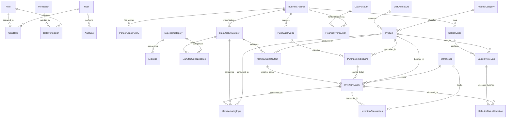

# Trading, Manufacturing & Inventory Management System
## Database Architecture, Schema Specification & ERD

---

## 1. Database Entity-Relationship Diagram (ERD)

---

## 2. Table Specifications & Data Dictionary

All financial amounts and stock quantities utilize PostgreSQL `NUMERIC(18, 4)` to eliminate floating-point imprecision.

### 2.1 Security & Access Control

#### `User`
| Column | Type | Constraints | Description |
|---|---|---|---|
| `id` | `VARCHAR(36)` | PK | UUID / CUID |
| `name` | `VARCHAR(100)` | NOT NULL | Display name |
| `email` | `VARCHAR(150)` | UNIQUE, NOT NULL | Login email |
| `passwordHash`| `VARCHAR(255)` | NOT NULL | bcryptjs hashed password |
| `isActive` | `BOOLEAN` | DEFAULT TRUE | Account state |
| `createdAt` | `TIMESTAMPTZ` | DEFAULT NOW() | Creation timestamp |
| `updatedAt` | `TIMESTAMPTZ` | DEFAULT NOW() | Last update |

#### `Role`
| Column | Type | Constraints | Description |
|---|---|---|---|
| `id` | `VARCHAR(36)` | PK | UUID / CUID |
| `code` | `VARCHAR(50)` | UNIQUE, NOT NULL | `ADMIN`, `MANAGER`, `ACCOUNTANT`, `SALES`, `WAREHOUSE`, `USER` |
| `name` | `VARCHAR(100)` | NOT NULL | Arabic/English role name |
| `description` | `TEXT` | NULLABLE | Role scope |

#### `Permission`
| Column | Type | Constraints | Description |
|---|---|---|---|
| `id` | `VARCHAR(36)` | PK | UUID / CUID |
| `code` | `VARCHAR(100)`| UNIQUE, NOT NULL | e.g. `sales.sell_below_cost`, `purchases.post`, `manufacturing.close` |
| `module` | `VARCHAR(50)` | NOT NULL | e.g. `sales`, `inventory`, `manufacturing`, `accounting` |
| `description` | `TEXT` | NOT NULL | Action description |

#### `AuditLog`
| Column | Type | Constraints | Description |
|---|---|---|---|
| `id` | `VARCHAR(36)` | PK | UUID / CUID |
| `userId` | `VARCHAR(36)` | FK -> User(id), NULLABLE | Acting user (null if system action) |
| `action` | `VARCHAR(100)`| NOT NULL | e.g. `SALE_BELOW_COST_APPROVED`, `MANUFACTURING_CLOSED` |
| `entity` | `VARCHAR(50)` | NOT NULL | e.g. `SalesInvoice`, `ManufacturingOrder`, `InventoryBatch` |
| `entityId` | `VARCHAR(36)` | NOT NULL | Target entity record ID |
| `previousState`| `JSONB` | NULLABLE | Snapshot prior to modification |
| `newState` | `JSONB` | NULLABLE | Snapshot post modification |
| `ipAddress` | `VARCHAR(45)` | NULLABLE | Client IP address |
| `userAgent` | `VARCHAR(255)`| NULLABLE | Client browser user agent |
| `createdAt` | `TIMESTAMPTZ` | DEFAULT NOW() | Audit timestamp |

---

### 2.2 Master Data & Business Partners

#### `BusinessPartner`
| Column | Type | Constraints | Description |
|---|---|---|---|
| `id` | `VARCHAR(36)` | PK | UUID / CUID |
| `code` | `VARCHAR(50)` | UNIQUE, NOT NULL | e.g. `BP-0001` |
| `name` | `VARCHAR(150)`| NOT NULL | Partner name (English/Common) |
| `nameAr` | `VARCHAR(150)`| NOT NULL | Partner Arabic name |
| `phone` | `VARCHAR(30)` | NULLABLE | Phone number |
| `mobile` | `VARCHAR(30)` | NULLABLE | Mobile contact |
| `email` | `VARCHAR(150)`| NULLABLE | Primary email |
| `address` | `TEXT` | NULLABLE | Physical address |
| `taxNumber` | `VARCHAR(50)` | NULLABLE | Tax / VAT identification |
| `isSupplier` | `BOOLEAN` | DEFAULT FALSE | Supplier role flag |
| `isCustomer` | `BOOLEAN` | DEFAULT FALSE | Customer role flag |
| `isFactory` | `BOOLEAN` | DEFAULT FALSE | Factory / Manufacturer role flag |
| `creditLimit` | `NUMERIC(18,4)`| DEFAULT 0.0000 | Maximum credit allowance |
| `paymentTermsDays`| `INT` | DEFAULT 0 | Payment terms in days |
| `openingBalance`| `NUMERIC(18,4)`| DEFAULT 0.0000 | Initial starting balance |
| `currentBalance`| `NUMERIC(18,4)`| DEFAULT 0.0000 | Reconcilable cached balance |
| `isActive` | `BOOLEAN` | DEFAULT TRUE | Status |
| `notes` | `TEXT` | NULLABLE | Additional remarks |

#### `ProductCategory` & `UnitOfMeasure`
- `ProductCategory`: `id`, `code`, `name`, `nameAr`, `description`.
- `UnitOfMeasure`: `id`, `code`, `name`, `nameAr`, `symbol` (e.g. `KG`, `METER`, `PIECE`, `TON`).

#### `Product`
| Column | Type | Constraints | Description |
|---|---|---|---|
| `id` | `VARCHAR(36)` | PK | UUID / CUID |
| `sku` | `VARCHAR(50)` | UNIQUE, NOT NULL | Item code / Barcode |
| `name` | `VARCHAR(150)`| NOT NULL | Product English name |
| `nameAr` | `VARCHAR(150)`| NOT NULL | Product Arabic name |
| `categoryId` | `VARCHAR(36)` | FK -> ProductCategory(id) | Category reference |
| `uomId` | `VARCHAR(36)` | FK -> UnitOfMeasure(id) | Base unit of measure |
| `itemType` | `ENUM` | NOT NULL | `RAW_MATERIAL`, `SEMI_FINISHED`, `FINISHED_PRODUCT`, `SERVICE`, `OTHER` |
| `defaultSellingPrice`| `NUMERIC(18,4)`| NOT NULL, DEFAULT 0 | Default selling catalogue price |
| `minSellingPrice` | `NUMERIC(18,4)`| DEFAULT 0 | Minimum allowed price floor |
| `referenceCost` | `NUMERIC(18,4)`| DEFAULT 0 | Reference cost for estimations |
| `isActive` | `BOOLEAN` | DEFAULT TRUE | Status |

#### `Warehouse`
| Column | Type | Constraints | Description |
|---|---|---|---|
| `id` | `VARCHAR(36)` | PK | UUID / CUID |
| `code` | `VARCHAR(50)` | UNIQUE, NOT NULL | Warehouse identifier (e.g. `WH-01`) |
| `name` | `VARCHAR(100)`| NOT NULL | English warehouse name |
| `nameAr` | `VARCHAR(100)`| NOT NULL | Arabic warehouse name |
| `address` | `TEXT` | NULLABLE | Location |
| `isActive` | `BOOLEAN` | DEFAULT TRUE | Status |

---

### 2.3 Inventory & Batch Management

#### `InventoryBatch`
| Column | Type | Constraints | Description |
|---|---|---|---|
| `id` | `VARCHAR(36)` | PK | UUID / CUID |
| `batchNumber` | `VARCHAR(50)` | UNIQUE, NOT NULL | Unique batch identifier (e.g. `BAT-2026-000001`) |
| `productId` | `VARCHAR(36)` | FK -> Product(id), NOT NULL | Linked product |
| `warehouseId` | `VARCHAR(36)` | FK -> Warehouse(id), NOT NULL | Current storage location |
| `sourceType` | `ENUM` | NOT NULL | `PURCHASE`, `MANUFACTURING`, `OPENING_BALANCE`, `ADJUSTMENT`, `RETURN` |
| `sourceDocumentId` | `VARCHAR(36)`| NULLABLE | ID of source purchase or manufacturing order |
| `sourceDocumentLineId`| `VARCHAR(36)`| NULLABLE | Line ID in source document |
| `initialQuantity`| `NUMERIC(18,4)`| NOT NULL, CHECK > 0 | Original received quantity |
| `remainingQuantity`| `NUMERIC(18,4)`| NOT NULL, CHECK >= 0| Unconsumed/unsold stock |
| `unitCost` | `NUMERIC(18,4)`| NOT NULL, CHECK >= 0| Unit acquisition or manufacturing cost |
| `totalCost` | `NUMERIC(18,4)`| NOT NULL, CHECK >= 0| Total batch value |
| `createdAt` | `TIMESTAMPTZ` | DEFAULT NOW() | Receipt date |

#### `InventoryTransaction`
| Column | Type | Constraints | Description |
|---|---|---|---|
| `id` | `VARCHAR(36)` | PK | UUID / CUID |
| `transactionNumber`| `VARCHAR(50)`| UNIQUE, NOT NULL | Identifier (e.g. `ITX-2026-000001`) |
| `productId` | `VARCHAR(36)` | FK -> Product(id), NOT NULL | Product |
| `batchId` | `VARCHAR(36)` | FK -> InventoryBatch(id) | Associated batch |
| `warehouseId` | `VARCHAR(36)` | FK -> Warehouse(id), NOT NULL | Warehouse location |
| `quantity` | `NUMERIC(18,4)`| NOT NULL | Signed quantity (+ inbound, - outbound) |
| `unitCost` | `NUMERIC(18,4)`| NOT NULL | Unit cost at transaction time |
| `totalCost` | `NUMERIC(18,4)`| NOT NULL | Total cost at transaction time |
| `transactionType` | `ENUM` | NOT NULL | `PURCHASE_RECEIPT`, `SALE`, `SALE_RETURN`, `MANUFACTURING_CONSUMPTION`, `MANUFACTURING_OUTPUT`, `TRANSFER_IN`, `TRANSFER_OUT`, `ADJUSTMENT_IN`, `ADJUSTMENT_OUT`, `OPENING_BALANCE` |
| `referenceDocumentType`| `VARCHAR(50)`| NOT NULL | `PurchaseInvoice`, `ManufacturingOrder`, `SalesInvoice`, etc. |
| `referenceDocumentId` | `VARCHAR(36)`| NOT NULL | Source record primary key |
| `userId` | `VARCHAR(36)` | FK -> User(id) | User who triggered the movement |
| `notes` | `TEXT` | NULLABLE | Transaction details |
| `createdAt` | `TIMESTAMPTZ` | DEFAULT NOW() | Transaction timestamp |

---

### 2.4 Purchasing & Invoices

#### `PurchaseInvoice`
| Column | Type | Constraints | Description |
|---|---|---|---|
| `id` | `VARCHAR(36)` | PK | UUID / CUID |
| `invoiceNumber` | `VARCHAR(50)` | UNIQUE, NOT NULL | e.g. `PUR-2026-000001` |
| `supplierId` | `VARCHAR(36)` | FK -> BusinessPartner(id), NOT NULL | Supplier partner |
| `warehouseId` | `VARCHAR(36)` | FK -> Warehouse(id), NOT NULL | Receiving warehouse |
| `invoiceDate` | `DATE` | NOT NULL | Document date |
| `dueDate` | `DATE` | NULLABLE | Due date for payment |
| `paymentTerms` | `VARCHAR(50)` | NULLABLE | Payment conditions |
| `status` | `ENUM` | NOT NULL | `DRAFT`, `OPEN`, `PARTIALLY_PAID`, `PAID`, `CANCELLED` |
| `subtotal` | `NUMERIC(18,4)`| NOT NULL, DEFAULT 0 | Sum of line totals |
| `discountAmount`| `NUMERIC(18,4)`| DEFAULT 0 | Total invoice discount |
| `taxAmount` | `NUMERIC(18,4)`| DEFAULT 0 | Applicable tax/VAT |
| `totalAmount` | `NUMERIC(18,4)`| NOT NULL, DEFAULT 0 | Final payable invoice total |
| `paidAmount` | `NUMERIC(18,4)`| DEFAULT 0 | Settled amount |
| `remainingAmount`| `NUMERIC(18,4)`| DEFAULT 0 | Outstanding payable balance |
| `createdById` | `VARCHAR(36)` | FK -> User(id) | Creator |
| `notes` | `TEXT` | NULLABLE | Notes |

#### `PurchaseInvoiceLine`
| Column | Type | Constraints | Description |
|---|---|---|---|
| `id` | `VARCHAR(36)` | PK | UUID / CUID |
| `purchaseInvoiceId`| `VARCHAR(36)`| FK -> PurchaseInvoice(id), NOT NULL | Header reference |
| `productId` | `VARCHAR(36)` | FK -> Product(id), NOT NULL | Item |
| `quantity` | `NUMERIC(18,4)`| NOT NULL, CHECK > 0 | Ordered / received quantity |
| `unitCost` | `NUMERIC(18,4)`| NOT NULL, CHECK >= 0| Cost per unit |
| `discountAmount`| `NUMERIC(18,4)`| DEFAULT 0 | Line discount |
| `taxRate` | `NUMERIC(5,2)` | DEFAULT 0 | Line tax % |
| `taxAmount` | `NUMERIC(18,4)`| DEFAULT 0 | Tax value |
| `lineTotal` | `NUMERIC(18,4)`| NOT NULL | Net line total |
| `batchId` | `VARCHAR(36)` | FK -> InventoryBatch(id), NULLABLE | Generated batch upon posting |

---

### 2.5 Outsourced Manufacturing Engine

#### `ManufacturingOrder`
| Column | Type | Constraints | Description |
|---|---|---|---|
| `id` | `VARCHAR(36)` | PK | UUID / CUID |
| `orderNumber` | `VARCHAR(50)` | UNIQUE, NOT NULL | e.g. `MFG-2026-000001` |
| `factoryId` | `VARCHAR(36)` | FK -> BusinessPartner(id), NOT NULL | Factory partner |
| `warehouseId` | `VARCHAR(36)` | FK -> Warehouse(id), NOT NULL | Base warehouse |
| `startDate` | `DATE` | NOT NULL | Operation start |
| `expectedCompletionDate`| `DATE` | NULLABLE | Estimated finish |
| `actualCompletionDate` | `DATE` | NULLABLE | Actual closing date |
| `status` | `ENUM` | NOT NULL | `DRAFT`, `OPEN`, `IN_PROGRESS`, `READY_TO_CLOSE`, `CLOSED`, `CANCELLED` |
| `totalMaterialCost` | `NUMERIC(18,4)`| DEFAULT 0 | Total consumed materials cost |
| `totalExpenseCost` | `NUMERIC(18,4)`| DEFAULT 0 | Total Type A operational expenses |
| `totalFactoryCost` | `NUMERIC(18,4)`| DEFAULT 0 | Total Type B factory payable charges |
| `totalManufacturingCost`| `NUMERIC(18,4)`| DEFAULT 0 | Total accumulated cost |
| `costAllocationMethod` | `ENUM` | DEFAULT `MANUAL_PERCENTAGE` | Allocation strategy |
| `closedById` | `VARCHAR(36)` | FK -> User(id), NULLABLE | Closing user |
| `closedAt` | `TIMESTAMPTZ` | NULLABLE | Timestamp of closure |
| `notes` | `TEXT` | NULLABLE | Operation notes |

#### `ManufacturingInput`
| Column | Type | Constraints | Description |
|---|---|---|---|
| `id` | `VARCHAR(36)` | PK | UUID / CUID |
| `manufacturingOrderId`| `VARCHAR(36)`| FK -> ManufacturingOrder(id), NOT NULL | Order reference |
| `productId` | `VARCHAR(36)` | FK -> Product(id), NOT NULL | Consumed product |
| `batchId` | `VARCHAR(36)` | FK -> InventoryBatch(id), NOT NULL | Consumed batch |
| `quantity` | `NUMERIC(18,4)`| NOT NULL, CHECK > 0 | Consumed quantity |
| `unitCost` | `NUMERIC(18,4)`| NOT NULL | Batch unit cost absorbed |
| `totalCost` | `NUMERIC(18,4)`| NOT NULL | Quantity * unitCost |
| `notes` | `TEXT` | NULLABLE | Input notes |

#### `ManufacturingExpense`
| Column | Type | Constraints | Description |
|---|---|---|---|
| `id` | `VARCHAR(36)` | PK | UUID / CUID |
| `manufacturingOrderId`| `VARCHAR(36)`| FK -> ManufacturingOrder(id), NOT NULL | Order reference |
| `categoryId` | `VARCHAR(36)` | FK -> ExpenseCategory(id), NOT NULL | Category (e.g. transport) |
| `expenseType` | `ENUM` | NOT NULL | `GENERAL_OPERATIONAL` (Type A), `FACTORY_PAYABLE` (Type B) |
| `amount` | `NUMERIC(18,4)`| NOT NULL, CHECK > 0 | Charge amount |
| `factoryId` | `VARCHAR(36)` | FK -> BusinessPartner(id), NULLABLE | Credited factory if Type B |
| `cashAccountId` | `VARCHAR(36)` | FK -> CashAccount(id), NULLABLE | Source account if direct cash paid |
| `description` | `VARCHAR(255)`| NOT NULL | Expense details |

#### `ManufacturingOutput`
| Column | Type | Constraints | Description |
|---|---|---|---|
| `id` | `VARCHAR(36)` | PK | UUID / CUID |
| `manufacturingOrderId`| `VARCHAR(36)`| FK -> ManufacturingOrder(id), NOT NULL | Order reference |
| `productId` | `VARCHAR(36)` | FK -> Product(id), NOT NULL | Produced item |
| `warehouseId` | `VARCHAR(36)` | FK -> Warehouse(id), NOT NULL | Destination warehouse |
| `quantity` | `NUMERIC(18,4)`| NOT NULL, CHECK > 0 | Produced quantity |
| `allocationPercentage`| `NUMERIC(7,4)`| NOT NULL, CHECK >= 0 AND <= 100| Percentage of total cost |
| `allocatedCost` | `NUMERIC(18,4)`| NOT NULL, DEFAULT 0 | Total cost assigned to this output |
| `calculatedUnitCost` | `NUMERIC(18,4)`| NOT NULL, DEFAULT 0 | `allocatedCost / quantity` |
| `batchId` | `VARCHAR(36)` | FK -> InventoryBatch(id), NULLABLE | Created inventory batch |
| `notes` | `TEXT` | NULLABLE | Output notes |

---

### 2.6 Sales & Batch Allocation

#### `SalesInvoice`
| Column | Type | Constraints | Description |
|---|---|---|---|
| `id` | `VARCHAR(36)` | PK | UUID / CUID |
| `invoiceNumber` | `VARCHAR(50)` | UNIQUE, NOT NULL | e.g. `SAL-2026-000001` |
| `customerId` | `VARCHAR(36)` | FK -> BusinessPartner(id), NOT NULL | Customer partner |
| `warehouseId` | `VARCHAR(36)` | FK -> Warehouse(id), NOT NULL | Origin warehouse |
| `invoiceDate` | `DATE` | NOT NULL | Invoice date |
| `dueDate` | `DATE` | NULLABLE | Payment due date |
| `paymentMethod` | `ENUM` | NOT NULL | `CASH`, `CREDIT`, `BANK_TRANSFER`, `PARTIAL` |
| `status` | `ENUM` | NOT NULL | `DRAFT`, `OPEN`, `PARTIALLY_PAID`, `PAID`, `CANCELLED` |
| `subtotal` | `NUMERIC(18,4)`| NOT NULL, DEFAULT 0 | Line sum |
| `discountAmount`| `NUMERIC(18,4)`| DEFAULT 0 | Invoice discount |
| `taxAmount` | `NUMERIC(18,4)`| DEFAULT 0 | Tax amount |
| `totalAmount` | `NUMERIC(18,4)`| NOT NULL, DEFAULT 0 | Receivable invoice total |
| `paidAmount` | `NUMERIC(18,4)`| DEFAULT 0 | Amount received |
| `remainingAmount`| `NUMERIC(18,4)`| DEFAULT 0 | Outstanding balance |
| `totalCost` | `NUMERIC(18,4)`| NOT NULL, DEFAULT 0 | Exact cost of goods sold |
| `grossProfit` | `NUMERIC(18,4)`| NOT NULL, DEFAULT 0 | `totalAmount - totalCost` |
| `hasBelowCostLines`| `BOOLEAN` | DEFAULT FALSE | Flag indicating sales below cost |
| `createdById` | `VARCHAR(36)` | FK -> User(id) | Creator |
| `notes` | `TEXT` | NULLABLE | Invoice notes |

#### `SalesInvoiceLine`
| Column | Type | Constraints | Description |
|---|---|---|---|
| `id` | `VARCHAR(36)` | PK | UUID / CUID |
| `salesInvoiceId`| `VARCHAR(36)`| FK -> SalesInvoice(id), NOT NULL | Header reference |
| `productId` | `VARCHAR(36)` | FK -> Product(id), NOT NULL | Sold product |
| `quantity` | `NUMERIC(18,4)`| NOT NULL, CHECK > 0 | Total line quantity |
| `unitPrice` | `NUMERIC(18,4)`| NOT NULL, CHECK >= 0| Selling unit price |
| `discountAmount`| `NUMERIC(18,4)`| DEFAULT 0 | Line discount |
| `netUnitPrice` | `NUMERIC(18,4)`| NOT NULL | `(unitPrice * quantity - discount) / quantity` |
| `lineSubtotal` | `NUMERIC(18,4)`| NOT NULL | Net total selling price |
| `totalCost` | `NUMERIC(18,4)`| NOT NULL, DEFAULT 0 | Weighted batch cost sum |
| `grossProfit` | `NUMERIC(18,4)`| NOT NULL, DEFAULT 0 | `lineSubtotal - totalCost` |
| `isBelowCost` | `BOOLEAN` | DEFAULT FALSE | Flag for loss-making line |
| `belowCostApprovedById`| `VARCHAR(36)`| FK -> User(id), NULLABLE | Approver of sale below cost |

#### `SaleLineBatchAllocation`
| Column | Type | Constraints | Description |
|---|---|---|---|
| `id` | `VARCHAR(36)` | PK | UUID / CUID |
| `salesInvoiceLineId`| `VARCHAR(36)`| FK -> SalesInvoiceLine(id), NOT NULL | Sale line |
| `batchId` | `VARCHAR(36)` | FK -> InventoryBatch(id), NOT NULL | Exact lot drawn from |
| `quantity` | `NUMERIC(18,4)`| NOT NULL, CHECK > 0 | Quantity drawn from this batch |
| `unitCost` | `NUMERIC(18,4)`| NOT NULL | Actual batch unit cost |
| `totalCost` | `NUMERIC(18,4)`| NOT NULL | `quantity * unitCost` |

---

### 2.7 Ledger, Cash Accounts & Financials

#### `PartnerLedgerEntry`
| Column | Type | Constraints | Description |
|---|---|---|---|
| `id` | `VARCHAR(36)` | PK | UUID / CUID |
| `entryNumber` | `VARCHAR(50)` | UNIQUE, NOT NULL | Sequence e.g. `LED-2026-000001` |
| `partnerId` | `VARCHAR(36)` | FK -> BusinessPartner(id), NOT NULL | Linked partner |
| `entryDate` | `DATE` | NOT NULL | Transaction date |
| `referenceType` | `ENUM` | NOT NULL | `PURCHASE_INVOICE`, `SALES_INVOICE`, `MANUFACTURING_CHARGE`, `PAYMENT`, `RECEIPT`, `RETURN`, `ADJUSTMENT` |
| `referenceId` | `VARCHAR(36)` | NOT NULL | Document record ID |
| `referenceNumber`| `VARCHAR(50)`| NOT NULL | Document human code (e.g. `PUR-2026-000001`) |
| `debit` | `NUMERIC(18,4)`| NOT NULL, DEFAULT 0 | Debit amount |
| `credit` | `NUMERIC(18,4)`| NOT NULL, DEFAULT 0 | Credit amount |
| `balanceAfter` | `NUMERIC(18,4)`| NOT NULL | Running balance snapshot |
| `description` | `VARCHAR(255)`| NOT NULL | Narrative |
| `createdById` | `VARCHAR(36)` | FK -> User(id) | Operating user |
| `createdAt` | `TIMESTAMPTZ` | DEFAULT NOW() | Timestamp |

#### `CashAccount` & `FinancialTransaction`
- `CashAccount`: Stores treasury drawers, banks, and petty cash (`id`, `code`, `name`, `nameAr`, `accountType`, `balance`, `currency`, `isActive`).
- `FinancialTransaction`: Records payment outflows and receipt inflows (`id`, `transactionNumber`, `transactionType` [`PAYMENT`, `RECEIPT`], `partnerId`, `cashAccountId`, `amount`, `paymentMethod`, `paymentDate`, `referenceDocumentType`, `referenceDocumentId`, `notes`, `createdById`).

#### `DocumentSequence`
Stores atomic concurrency counters for human-readable contiguous numbering:
- `id`, `documentType` (`PURCHASE`, `SALE`, `MANUFACTURING`, `PAYMENT`, `RECEIPT`, `EXPENSE`, `BATCH`, `INVENTORY_TX`, `LEDGER`), `prefix`, `year`, `currentNumber`, `updatedAt`.
