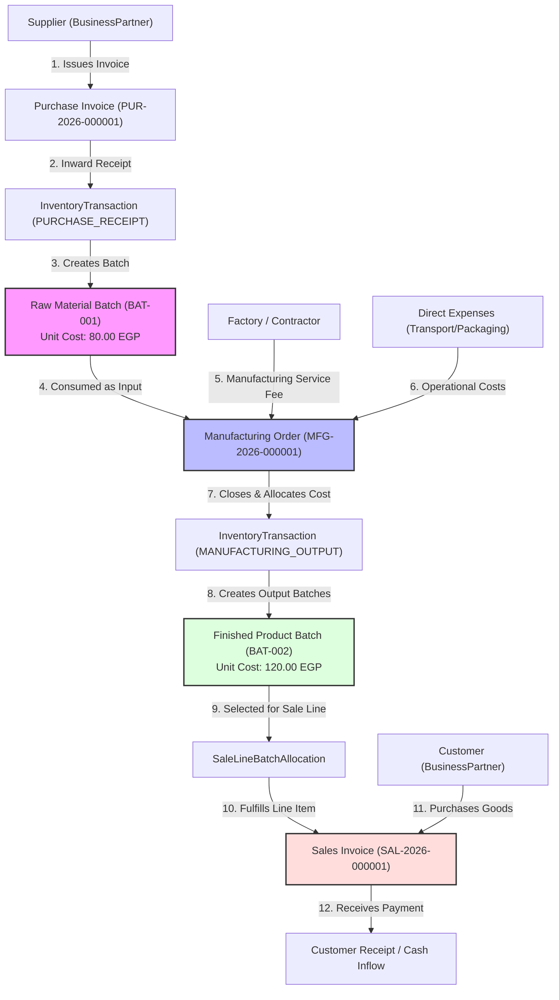
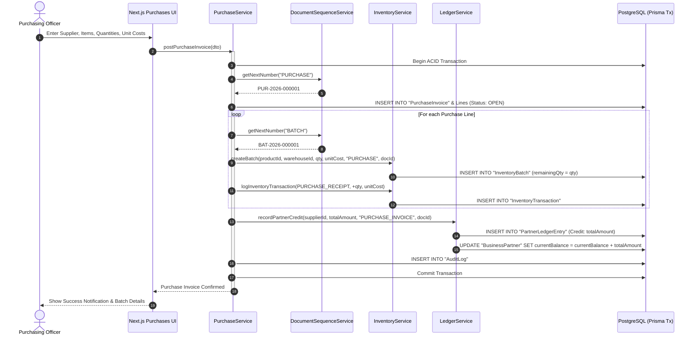
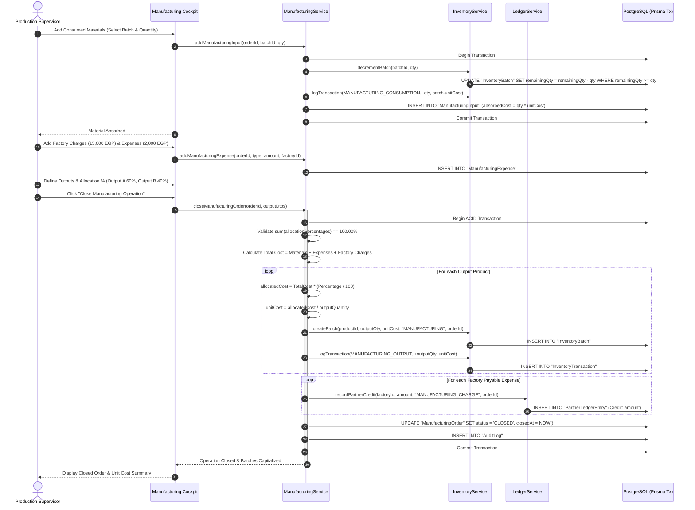
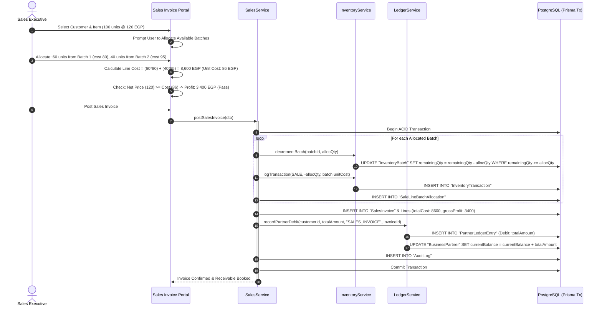
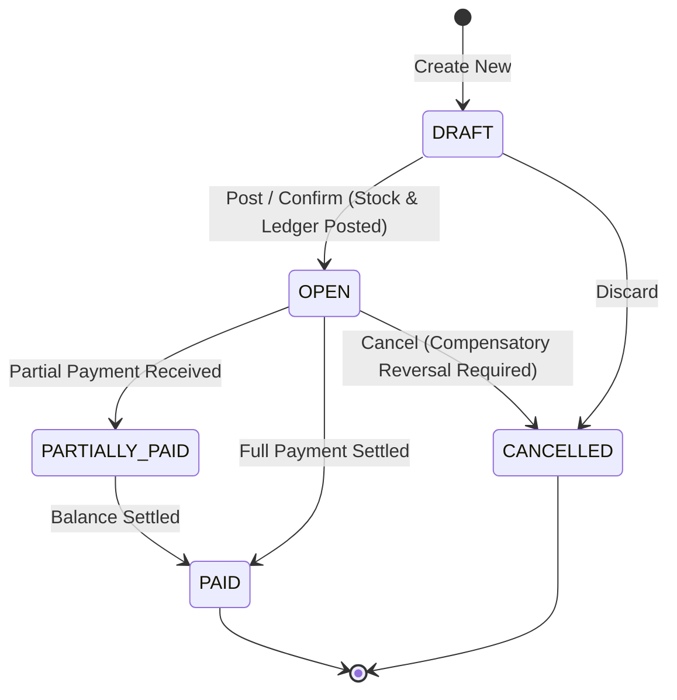
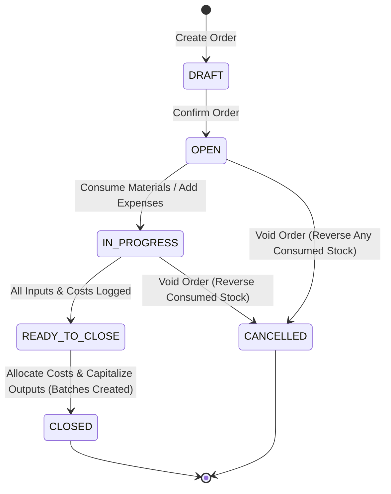
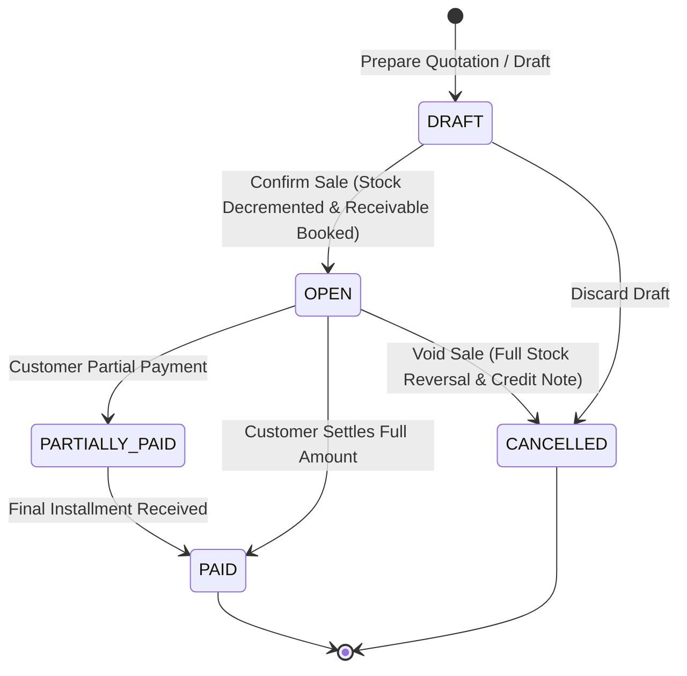

# Trading, Manufacturing & Inventory Management System
## System Workflows, Sequence Diagrams & State Machines

---

## 1. Complete End-to-End Traceability Workflow

---

## 2. Purchase Posting & Inward Logistics Workflow

---

## 3. Outsourced Manufacturing Execution & Closure Workflow

---

## 4. Sales Invoicing & Multi-Batch Allocation Workflow

---

## 5. Document State Machine Diagrams

### 5.1 Purchase Invoice State Machine

### 5.2 Manufacturing Order State Machine

### 5.3 Sales Invoice State Machine

